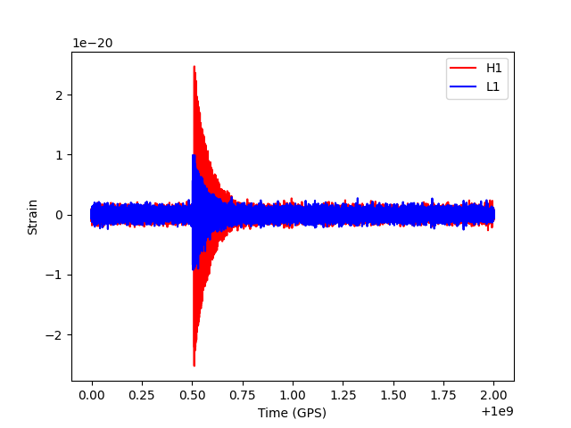

# ringdown

Package to create (fundamental mode) ring-down (exponentially damped sinusoid) gravitational
wave signals and template banks.

## Installation

To install the package clone this repository with, e.g.:

```bash
git clone https://github.com/mattpitkin/ringdown.git
```

Then run:

```bash
cd ringdown
pip install .
```

This code requires [PyCBC](https://pycbc.org/), which will automatically be installed by the above
command if not already installed.

## Generate fake signal

Below is an example of generating a fake signal in the two LIGO detectors. It has a very
exaggerated signal amplitude, so that it is each to see above the noise.

```python
from matplotlib import pyplot as plt
import ringdown

starttime = 1000000000.0  # start time of data
duration = 2.0  # duration of data
dt = 1.0 / 8192.0  # time step

tc = starttime + 0.5  # start time of the ring-down signal (GPS second)
freq = 1234.5  # frequency of signal (Hz)
amp = 1e-19  # amplitude of signal (intentionally very large!)
tau = 0.07  # decay time (seconds)
ra = 0.3  # source right ascension (rads)
dec = -0.3  # source declination (rads)
psi = 1.1  # source polarisation angle (rads)
phi = 0.2  # initial phase (rads)
inclination = 0.9  # source inclination angle (rads)

detector = "H1"

# default PSD will be aLIGO design curve
injH1 = ringdown.RingdownInjections(
    tc,
    freq,
    amp,
    tau,
    ra,
    dec,
    psis=psi,
    phis=phi,
    inclinations=inclination,
    detector=detector,
    starttime=starttime,
    duration=duration,
    deltat=dt,
)

# injection for L1
detector = "L1"
injL1 = ringdown.RingdownInjections(
    tc,
    freq,
    amp,
    tau,
    ra,
    dec,
    psis=psi,
    phis=phi,
    inclinations=inclination,
    detector=detector,
    starttime=starttime,
    duration=duration,
    deltat=dt,
)

# plot the figures
fig, ax = plt.subplots()
ax.plot(injH1.data.sample_times, injH1.data, "r", label="H1")
ax.plot(injL1.data.sample_times, injL1.data, "b", label="L1")
ax.legend()
ax.set_xlabel("Time (GPS)")
ax.set_ylabel("Strain")
```


